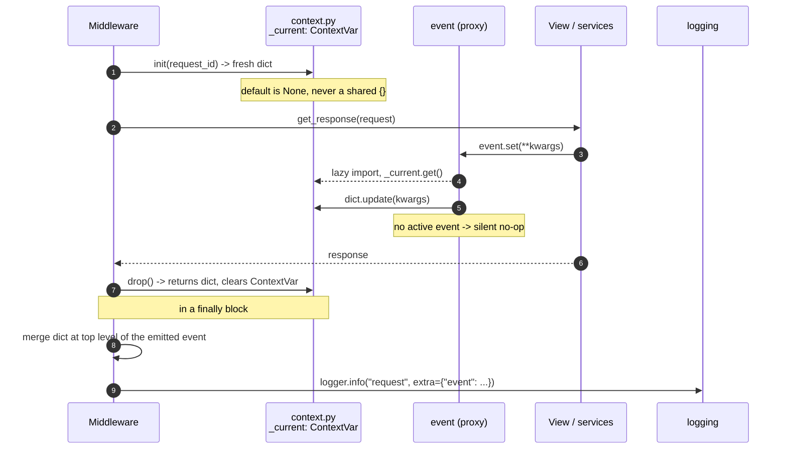
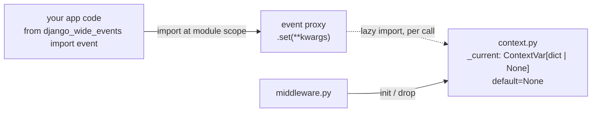
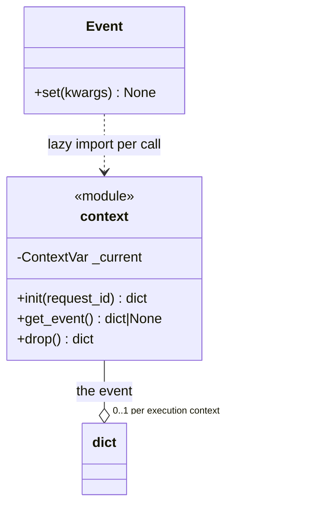

```

src/django-wide-events
    config
    collectors/
        __init__
        HTTP
        ...
    

```

## Basic Workflow

One dict per request. The middleware creates it, anything anywhere writes to it
through the `event` proxy, and the middleware takes it back with `drop()`.



`drop()` replaces the usual `set()`/`reset(token)` pair: the middleware owns the
whole lifecycle, so there is no outer value to restore — clearing is enough, and
handing the dict back in the same call means the middleware never reads the
ContextVar after it has been cleared.

## Context Vars

`context.py` owns the ContextVar and imports nothing from the rest of the package
(and nothing from Django). The `event` proxy resolves it **lazily, on each call**,
so importing `event` at module scope anywhere in a host project is safe and cannot
close over a stale context.





# Step 1 - Event Core

**Goal:** an event exists per request, code anywhere can write to it, and writing
outside one is harmless.

**Observable outcome:** pure pytest tests. No Django client, no settings, no
middleware, no logging. If a test here needs `client`, the step has grown too big.

## In scope

1. `context.py` — **no Django imports at all**
2. `EventContext`: the event dict + `source` ("request"/"command"/"task"),
   `request`/`response` (None here), `started_at`
3. The ContextVar holding the current `EventContext`
4. `get_event()` -> `dict | None`
5. The `event` proxy — module-level, safe to import anywhere, resolves to the
   current context **on each call**: `.set(**kwargs)`, `.update(dict)`
6. An enter/exit helper (contextmanager) that sets the ContextVar and **resets the
   token** on the way out

## Out of scope — deliberately

- `event.timer()` / `event.incr()` — conveniences over `.set()`, and `timer()` hides
  an undecided naming rule (`"s3.fetch"` -> `s3_fetch_ms`). Nothing downstream blocks
  on them.
- Blocks — they attach to the core, but the attach/flush lifecycle is its own step
- Settings — the core reads none. Keep it that way; it is what keeps `context.py`
  Django-free.
- The middleware. Step 1 proves the core works; step 2 drives it from a request.

## How ContextVars work — the short version

`contextvars.ContextVar` is stdlib (3.7+). Think of it as a global whose value is
scoped to "the current execution context" — one value per thread, and one per asyncio
task, without either of them seeing the others'.

```python
_current: ContextVar[EventContext | None] = ContextVar("wide_event", default=None)

token = _current.set(ctx)   # set() returns a Token = the PREVIOUS value
try:
    ...                     # anything called from here sees ctx via _current.get()
finally:
    _current.reset(token)   # restore what was there before
```

Four properties that matter for us:

- **Reads are ambient.** Deep service code calls `_current.get()` with no arguments and
  no plumbing — that is why there is no `request.event`.
- **`set()` returns a Token, not None.** `reset(token)` puts back the *previous* value,
  which is why the enter/exit helper has to hold onto it. Ignoring the token is the
  classic bug.
- **A new asyncio task copies the current context.** Values set before the task started
  are visible inside it; values the task sets afterwards are invisible to the parent.
  Awaiting in the same task keeps everything as-is, which is what makes one async
  middleware work.
- **A new thread starts empty**, but a *reused* one does not — WSGI runs requests on a
  worker pool, so a context left unreset stays visible to whatever request lands on that
  worker next. Hence the `finally`.

## Decide while building

- **Deep merge semantics.** §2 says `update()` is "deep-merged" — merge nested dicts
  recursively, or replace at the top level? Lists: replace or extend?
- **No-op return value.** Writing with no active event is a silent no-op — does
  `.set()` return `self` (so chaining keeps working) or None?
- **Reset discipline.** Token per context, reset in a `finally`. This is the one thing
  in step 1 that silently corrupts data if wrong: a missed reset leaks one request's
  event into the next on a reused worker.

## Tests

- set -> `get_event()` roundtrip inside an active context
- write outside a context is a no-op; `get_event()` is None
- `update()` deep-merges rather than clobbering a sibling key
- two sequential contexts don't leak into each other
- the value survives an `await` (this is the ContextVar's whole point, and §11 promises
  async middleware)

# Step 2 - Formatter

1. Add working app-config and read settings
2. base collector and custom collector logic
3. Write Json Formatter (+ Indent)
4. Add static fields

# Step 3 - Middleware

1. Add settings
2. Build pluggable Middleware

# Step 4 - Filter

1. Incooperate settings
2. Write simple headsampling filter
3. Write Tailsampling filter
4. Add keep Rules

